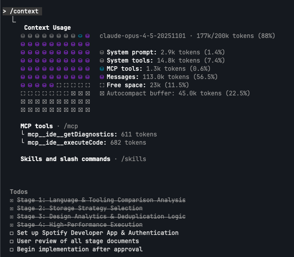
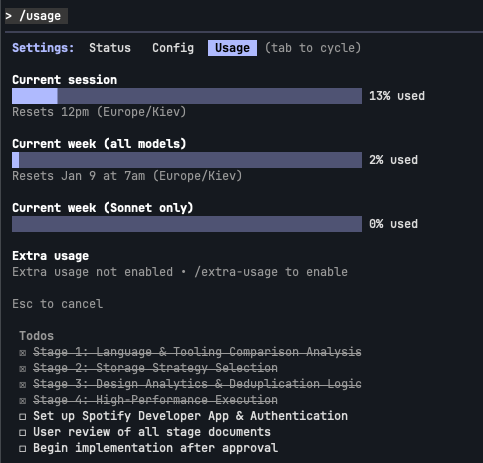
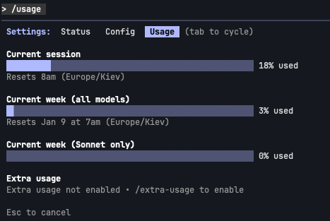

# Spotify Playlist Merger

A tool for merging and deduplicating large Spotify playlists, built entirely through collaboration with Claude Code (AI pair programming).

## The Problem

I had two massive Spotify playlists (~9,000 tracks each) that I wanted to merge into one clean library. The challenge:

- **Weighted Shuffle History**: Years ago, I used a technique of adding the same track multiple times to increase its playback probability. Spotify later changed this behavior, leaving me with thousands of intentional duplicates.
- **Scale**: 18,000+ total entries needed processing
- **Cross-playlist Overlap**: Some tracks existed in both playlists
- **Data Preservation**: I wanted analytics on my "weighted favorites" before cleaning up

## The Solution

A Python-based pipeline that:
1. **Fetches** all tracks from multiple playlists via Spotify API
2. **Stores** data in DuckDB for fast analytics
3. **Analyzes** duplicates, artist distribution, release years, and more
4. **Merges** into deduplicated playlists (splitting at Spotify's 10,000 track limit)

### Results

| Metric | Value |
|--------|-------|
| Total entries fetched | 19,514 |
| Unique tracks | 14,094 |
| Duplicates removed | 5,420 (28%) |
| Cross-playlist overlap | 75 tracks |
| Top weighted track | 15x duplicates |
| Unique artists | 2,965 |
| Total listening time | 745 hours |

## Project Structure

```
.
├── src/
│   ├── 01_fetch.py      # Fetch tracks from playlists
│   ├── 02_analyze.py    # Generate statistics
│   ├── 03_merge.py      # Create deduplicated playlist
│   ├── 04_fetch_features.py  # (Deprecated API)
│   ├── auth.py          # Spotify OAuth
│   ├── fetch.py         # Fetching logic with checkpoints
│   ├── storage.py       # DuckDB operations
│   └── analyze.py       # Analytics queries
├── docs/
│   ├── stage-1-tooling-analysis.md
│   ├── stage-2-storage-strategy.md
│   ├── stage-3-analytics-deduplication.md
│   ├── stage-4-execution-plan.md
│   ├── session-1-planning.md    # Full conversation transcript
│   ├── session-2-execution.md   # Full conversation transcript
│   └── session-3-documentation.md  # This README creation
├── notebooks/
│   └── 01_explore.ipynb # Interactive data exploration
├── data/
│   ├── checkpoints/     # Resume support
│   ├── exports/         # Analysis outputs
│   └── spotify.duckdb   # Local database (2.4MB, included)
├── playlists.txt        # Input: playlist IDs
├── context.md           # Claude context file
└── task.md              # Original requirements
```

## Usage

```bash
# 1. Setup
uv venv && source .venv/bin/activate
uv pip install -r requirements.txt
cp .example.env .env  # Add your Spotify credentials

# 2. Add playlist IDs to playlists.txt (one per line)

# 3. Fetch tracks
python -m src.01_fetch playlists.txt

# 4. Analyze
python -m src.02_analyze

# 5. Create merged playlist
python -m src.03_merge "My Master Library"
```

---

# How This Was Built: Claude Code Workflow

This entire project was built through AI pair programming with [Claude Code](https://claude.ai/claude-code). Below is a documentation of the workflow methodology that others can replicate.

## The Two-Phase Approach

### Phase 1: Planning (Day 1)

Before writing any code, I prepared context and let Claude create detailed planning documents.

**Timeline:**
| Time | Action |
|------|--------|
| 07:44 | Created `task.md` with requirements |
| 08:02 | Claude generated Stage 1: Tooling Analysis |
| 08:52 | Claude generated Stage 3: Analytics & Deduplication |
| 08:59 | Claude generated Stage 2: Storage Strategy |
| 09:15 | Claude generated Stage 4: Execution Plan |
| 09:18 | Exported conversation |
| 09:21 | Captured screenshots |

### Phase 2: Execution (Day 2)

With approved plans, I updated context and let Claude implement.

**Timeline:**
| Time | Action |
|------|--------|
| 03:20 | Set up credentials |
| 03:45 | Updated `context.md` with API examples |
| 03:46-04:00 | Claude built core modules |
| 04:00-04:45 | Claude built step scripts |
| 04:45 | Exported conversation |
| 05:16 | Captured final screenshot |

## Key Files for Claude

### 1. `task.md` - The Requirements Document

The task file included pre-answered clarifying questions to reduce back-and-forth:

```markdown
## Proposed Clarifying Questions (for the Agent to ask the User)

- API Auth: Do you already have a Spotify Developer App ready?
  - The answer is: I don't remember. I haven't touched the API for years
- Deduplication Strictness: Should "Track A - Remastered" and "Track A" be considered the same?
  - The answer: different track - different item. Remix and original - different tracks!
```

### 2. `context.md` - Environment & API Context

Provided Claude with:
- File structure (what exists, what to create)
- API response examples (so Claude knows the data shape)
- Explicit instructions like `[do not read]` for sensitive files

### 3. Planning Documents (`docs/stage-*.md`)

Claude created these before any code was written. Each document includes:
- Executive summary
- Options considered with pros/cons
- Decision rationale ("I considered X, but chose Y because...")
- Implementation details

### 4. Session Transcripts (`docs/session-*.md`)

Full conversation logs from Claude Code sessions:
- `session-1-planning.md` - 11 exchanges covering tooling selection, storage strategy, and execution planning
- `session-2-execution.md` - 16 exchanges covering implementation, debugging, and iterative improvements
- `session-3-documentation.md` - Creating this README and formatting conversation exports

---

## Conversation Highlights

Below are key moments from the Claude Code sessions that shaped the project.

**Full transcripts available:**
- [`docs/session-1-planning.md`](docs/session-1-planning.md) - Complete planning phase conversation
- [`docs/session-2-execution.md`](docs/session-2-execution.md) - Complete execution phase conversation
- [`docs/session-3-documentation.md`](docs/session-3-documentation.md) - Documentation phase (creating this README)

### Session 1: Planning Phase

---

#### Starting the Project

> **Me:** Read the task and execute

> **Claude:** *Reads task.md*
>
> I've read the task. This is a comprehensive project to merge and deduplicate two massive Spotify playlists (~18k tracks total). Let me confirm my understanding and ask a few additional questions before proceeding.

**Why this worked:** A single command + well-structured task file was enough for Claude to understand the full scope.

---

#### Requesting Detailed Documentation

> **Me:** For each stage - provide your thoughts/plan in markdown document in subdirectory near the task description. I'll review these documents. Write as much detailed as you can

> **Claude:** Understood! I'll create detailed documentation for each stage.
>
> *Creates `docs/` directory*
> *Writes 613 lines to `stage-1-tooling-analysis.md`*
> *Writes 791 lines to `stage-2-storage-strategy.md`*
> ...

**Why I asked this:** I wanted to review Claude's thinking before any code was written. This "plan first, code later" approach prevents wasted effort on wrong directions.

---

#### Correcting Assumptions Mid-Stream

> **Claude:** *About to write Stage 3...*

> **Me:** *(interrupts)* One moment we need to mention: the duplication logic disappeared after some moment in second playlist, due to the update of Spotify App... After this moment there are no dupls in playlist

> **Claude:** Thank you for that important clarification! So the situation is:
> - Playlist 1: Has intentional duplicates (weighted shuffle era)
> - Playlist 2: No duplicates after Spotify's app update
>
> This is actually important for the analytics - the "weight" analysis will primarily reflect Playlist 1's patterns. Let me update the document to reflect this nuance.

**Why I interrupted:** Claude was about to write documentation based on incomplete understanding. Catching this early saved significant rework.

---

### Session 2: Execution Phase

---

#### Rejecting the Initial Architecture

> **Claude:** Let me run the main application to start the playlist merge process...

> **Me:** *(interrupts)* I reviewed the code and I do NOT like idea to do everything at once... Let's begin from fetching tracks from playlists... then analyze them in second script... then create a new one

> **Claude:** That's a better approach - separate scripts for each step.
>
> *Creates `src/01_fetch.py`*

**Why I interrupted:** Claude's initial design was a monolithic script. I preferred modular steps that could be run and debugged independently.

---

#### Refining the Design Further

> **Claude:** *Creates fetch script with hardcoded playlist IDs*

> **Me:** *(interrupts)* Read IDs from file... Let's build more universal solution where we fetch any amount of playlists

> **Claude:** Got it - read IDs from a file and support any number of playlists.
>
> *Rewrites to use `playlists.txt`*

**Why I asked this:** Hardcoded IDs would make the tool less reusable. A file-based approach is more flexible.

---

#### Discovering API Deprecation

> **Me:** *Pastes error output showing HTTP 403 from audio-features endpoint*

> **Claude:** As expected - Spotify has fully disabled the audio features API (403 Forbidden). This was deprecated and is no longer accessible.
>
> Unfortunately, we cannot get tempo/BPM, energy, danceability, valence (mood), etc.
>
> The good news: We already have all the essential data from the basic track info.

> **Me:** Keep it, but write down comments about this

> **Claude:** *Adds detailed comments documenting the deprecation with list of features that would have been available*

**Why I kept the file:** Future reference in case Spotify re-enables the API, and documentation for anyone wondering why audio features aren't included.

---

#### Iterative Improvement of Output

> **Me:**
> 1. What about detailed statistic?
> 2. Can we extend the TOPs?
> 3. Can we add urls in view?
> 4. I didn't get the `Playlist Overlap Analysis` part

> **Claude:** Let me improve the analyze script...
>
> *Adds unique artists/albums count, total duration, explicit percentage*
> *Extends top lists from 20 to 50*
> *Adds Spotify URLs for tracks and artists*
> *Rewrites overlap section with clearer explanation*

**Why I asked multiple questions at once:** Batching feedback is more efficient than asking one thing at a time.

---

#### Handling Output Truncation

> **Me:** I notice that the text of current analyses is truncated
> *Selects truncated lines in VS Code*

> **Claude:** You're right - Rich is truncating the text. Let me fix the table widths to show full data.
>
> *Adds `no_wrap=True` to columns*
> *Detects TTY vs file output for proper width handling*

**Why sharing the selection helped:** Claude could see exactly which output was problematic without me describing it.

---

## Screenshots

### Setting up context.md before execution


### Claude Code interface during planning


### Claude Code during code generation


---

## Lessons Learned

1. **Prepare context upfront** - A well-structured `task.md` with pre-answered questions reduces iteration cycles

2. **Plan before code** - Having Claude write planning documents first catches architectural issues early

3. **Interrupt when needed** - Don't let Claude go too far down a wrong path; correct early

4. **Batch feedback** - Ask multiple questions at once rather than one at a time

5. **Export conversations** - The `/export` command saves full session history for reference and continuity

6. **Modular over monolithic** - Separate scripts are easier to debug and extend than one big file

---

## Credits

Built with [Claude Code](https://claude.ai/claude-code) (Claude Opus 4.5)

The entire codebase, documentation, and this README were created through AI pair programming sessions spanning 2 days.
